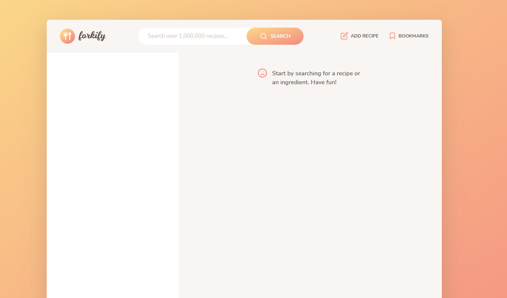

# Forkify


This web application allows users to search for recipes, in addition to creating new recipes and bookmarking them for later. The application is supported by the Forkify API that fetches recipes from numerous websites and publishers. A list of favourite recipes can be bookmarked and saved on local storage. Additionally, users can create a new recipe.

## Features

- Search functionality that displays results with pagination
- Display recipes with cooking time, servings and ingredients
- Change servings functionality
- Bookmarking functionality
- User can upload own recipe and will automatically be bookmarked
- Users can only see their own recipes and none from other users
- On page reload, saved bookmarks will be loaded from data in the browser using local storage

## Getting Started

To get started with project just simply fork this repo or download locally on your System.

To get a local copy up and running follow these simple example steps.

### Prerequisites

Start with the latest version of NPM to avoid any errors:

- npm
  ```sh
  npm install npm@latest -g
  ```
- Also install additional dependencies

```
 npm i --save core-js regenerator-runtime
```

### Installation

1. Get a free API Key at [Forkify API_KEY](https://forkify-api.herokuapp.com/v2)
2. Clone the repo
   ```sh
   gh repo clone caitlinmalloch/forkify
   ```
3. Install NPM packages
   ```sh
   npm install
   ```
4. Enter your API in `config.js`
   ```JS
   const KEY = 'ENTER YOUR API';
   ```

## Live Site

https://forkify-caitlinmalloch.netlify.app/

Currently hosted by Netlify

[](https://app.netlify.com/sites/forkify-caitlinmalloch/deploys)

## Tech Stack

- HTML
- SASS/CSS
- JavaScript
- [NPM](https://www.npmjs.com/)
- [Webpack](https://webpack.js.org/)

## UI Preview

The main UI is sleek and modern, and allows the user to search for recipes using the search bar. Results will be displayed on the bottom left in a list, and selected recipes will be expanded on the bottom right. To the top right, there is an option to add a recipe or bookmark a recipe.


## Build Specs

This is a final overview of the arhitecture of the Forkify application. The learning objective for this project is to consolidate learning of advanced JavaScript functions, classes and methods.


This is the flowchart used in design to build features.


## Developer

Caitlin Malloch

## License

MIT License

Copyright (c) 2023 Caitlin Malloch

Permission is hereby granted, free of charge, to any person obtaining a copy of this software and associated documentation files (the "Software"), to deal in the Software without restriction, including without limitation the rights to use, copy, modify, merge, publish, distribute, sublicense, and/or sell copies of the Software, and to permit persons to whom the Software is furnished to do so, subject to the following conditions:

The above copyright notice and this permission notice shall be included in all copies or substantial portions of the Software.

THE SOFTWARE IS PROVIDED "AS IS", WITHOUT WARRANTY OF ANY KIND, EXPRESS OR IMPLIED, INCLUDING BUT NOT LIMITED TO THE WARRANTIES OF MERCHANTABILITY, FITNESS FOR A PARTICULAR PURPOSE AND NONINFRINGEMENT. IN NO EVENT SHALL THE AUTHORS OR COPYRIGHT HOLDERS BE LIABLE FOR ANY CLAIM, DAMAGES OR OTHER LIABILITY, WHETHER IN AN ACTION OF CONTRACT, TORT OR OTHERWISE, ARISING FROM, OUT OF OR IN CONNECTION WITH THE SOFTWARE OR THE USE OR OTHER DEALINGS IN THE SOFTWARE.

## Acknowledgements

The Complete JavaScript Course 2023: From Zero to Expert!, Udemy
Jonas Schmedtmann

## Current Bugs

- Bookmark function issues

### Proposed features

1. Number of pages between the pagination buttons.

2. Ability to sort search results by duration or number of ingredients.

3. Ingredient validation in view, before submitting the form.

4. Improving recipe ingredient input: separate in multiple fields and allow more
   than 6 ingredients.

5. Shopping list feature: button on recipe to add ingredients to a list.

6. Weekly meal planning feature: assign recipes to the next 7 days and show
   on a weekly calendar.

7. Nutrition data on each ingredient from spoonacular API (https://
   spoonacular.com/food-api) and calculate total calories of recipe.
